# Xu hướng tiến hóa hệ thống kỹ thuật (TESE)

***Xu hướng tiến hóa hệ thống kỹ thuật** (Trends of Engineering Systems Evolution – TESE) là những hướng phát triển của hệ thống kỹ thuật đã được chứng minh bằng thống kê hoặc thực nghiệm, mô tả sự chuyển dịch tự nhiên của hệ thống kỹ thuật từ trạng thái này sang trạng thái khác. Một số tài liệu gọi lý thuyết này với tên khác, là "Quy luật phát triển hệ thống kỹ thuật".*

## Tổng quan

Việc nhận diện và thấu hiểu các xu hướng tiến hóa hệ thống kỹ thuật (TESE) có thể xem là đóng góp quan trọng nhất của TRIZ đối với khoa học đổi mới sáng tạo. Chúng cũng là nền tảng cho nhiều công cụ TRIZ khác.

TESE được hình thành từ quá trình phân tích sâu lịch sử phát triển của sản phẩm và công nghệ ở nhiều ngành. Khi nghiên cứu lịch sử – dựa trên hàng nghìn bằng sáng chế – người ta nhận thấy mọi sản phẩm và công nghệ đều tuân theo những mô thức khái niệm tương tự. TESE định nghĩa các giai đoạn mà gần như mọi sản phẩm và công nghệ sẽ trải qua trong quá trình phát triển. Điều này không có nghĩa là không thể thiết kế một sản phẩm lệch khỏi TESE, nhưng về lâu dài sản phẩm đó rất dễ thất bại.

Trọng tâm của TESE nằm ở giả định rằng công nghệ tiến hóa theo quỹ đạo riêng, độc lập với ý chí con người. Vì vậy, chúng thường được gọi là **tiếng nói của sản phẩm**. Tuy nhiên, để có hiệu quả tối đa, TESE cần được tích hợp với nhu cầu thị trường – tiếng nói của khách hàng.

## Cấu trúc phân cấp của TESE

TESE được tổ chức theo cấu trúc phân cấp phản ánh mối quan hệ giữa các xu hướng. Trong cấu trúc này, một xu hướng cấp thấp đóng vai trò là xu hướng con (cơ chế) của xu hướng cấp cao hơn. Đồng thời mỗi xu hướng cũng có cơ chế nội tại điều khiển sự tiến hóa của hệ thống. Nói cách khác, để hệ thống tiến hóa theo một xu hướng cấp cao, cả cơ chế nội tại của xu hướng đó lẫn cơ chế của các xu hướng con đều phải được triển khai.

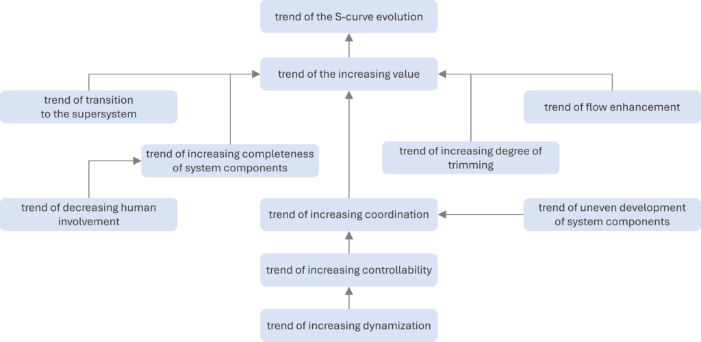

Cần lưu ý rằng TESE và cấu trúc của chúng đã phát triển qua nhiều thập kỷ, vì vậy trong tài liệu TRIZ có thể gặp các phiên bản khác nhau. Các định nghĩa và thứ bậc chính thức được MATRIZ công nhận do Trường phái khoa học TRIZ St. Petersburg – được xem là trường phái TRIZ thực dụng nhất – xây dựng.

- **Xu hướng tiến hóa đường cong chữ S**: khi hệ thống kỹ thuật tiến hóa, diễn biến của từng tham số giá trị chính (MPV) theo thời gian tạo thành đường cong chữ S.
- **Xu hướng gia tăng giá trị**: hệ thống kỹ thuật tiến hóa sao cho giá trị của nó luôn tăng.
- **Xu hướng chuyển sang siêu hệ**: khi hệ thống kỹ thuật tiến hóa, nó được tích hợp với các thành phần của siêu hệ.
- **Xu hướng gia tăng mức độ đầy đủ của các khối chức năng**: khi hệ thống kỹ thuật tiến hóa, nó lần lượt sở hữu các khối chức năng điển hình: tác nhân vận hành, truyền dẫn, nguồn năng lượng và hệ điều khiển.
- **Xu hướng giảm sự tham gia của con người**: khi hệ thống kỹ thuật tiến hóa, số chức năng do con người thực hiện thay cho hệ thống giảm dần.
- **Xu hướng gia tăng mức độ cắt gọn**: khi hệ thống kỹ thuật tiến hóa, các phần tử (thành phần hoặc thao tác) bị loại bỏ mà không làm suy giảm – thậm chí còn cải thiện – chức năng của hệ thống.
- **Xu hướng tăng cường dòng chảy**: khi hệ thống kỹ thuật tiến hóa, lưu lượng chất, năng lượng hoặc thông tin tăng lên và/hoặc được khai thác hiệu quả hơn.
- **Xu hướng gia tăng mức độ phối hợp**: khi hệ thống kỹ thuật tiến hóa, các đặc tính của các thành phần trong hệ và siêu hệ ngày càng được phối hợp tốt hơn với nhau.
- **Xu hướng phát triển không đồng đều của các thành phần**: khi hệ thống kỹ thuật tiến hóa, sự phát triển tập trung trước tiên vào tác nhân vận hành, sau đó mới đến các phần còn lại.
- **Xu hướng gia tăng khả năng điều khiển**: khi hệ thống kỹ thuật tiến hóa, nó phát triển thêm các cách thức để điều khiển.
- **Xu hướng gia tăng động hóa**: khi hệ thống kỹ thuật tiến hóa, bản thân hệ và các thành phần trở nên “động” hơn.

#### Bài viết

- Xu hướng tiến hóa đường cong chữ S
  - Tham số giá trị chính
  - Đường cong chữ S
- Xu hướng gia tăng giá trị
- Xu hướng chuyển sang siêu hệ
- Xu hướng gia tăng mức độ đầy đủ của các khối chức năng
- Xu hướng giảm sự tham gia của con người
- Xu hướng gia tăng mức độ cắt gọn
- Xu hướng tăng cường dòng chảy
- Xu hướng gia tăng mức độ phối hợp
- Xu hướng phát triển không đồng đều của các thành phần
- Xu hướng gia tăng khả năng điều khiển
- Xu hướng gia tăng động hóa

### Xu hướng giảm sự tham gia của con người

# Xu hướng giảm sự tham gia của con người

***Xu hướng giảm sự tham gia của con người**: khi hệ thống kỹ thuật tiến hóa, số chức năng do con người đảm nhiệm thay cho hệ thống giảm dần.*

## Tổng quan

Xu hướng giảm sự tham gia của con người là xu hướng con (cơ chế) của xu hướng gia tăng mức độ đầy đủ của các khối chức năng.

Trước khi một hệ thống kỹ thuật ra đời, con người phải tự thực hiện mọi chức năng ở mọi cấp độ – nếu không các chức năng đó không tồn tại. Sự xuất hiện của hệ thống và quá trình phát triển tiếp theo giúp hệ từng bước tiếp quản các chức năng (tăng mức độ đầy đủ), qua đó giảm sự tham gia của con người. Quá trình này thường diễn ra theo thứ tự:

1. truyền dẫn,
2. nguồn năng lượng,
3. hệ điều khiển, và
4. ra quyết định.

### Xu hướng tăng cường dòng chảy

# Xu hướng tăng cường dòng chảy

***Xu hướng tăng cường dòng chảy** là [xu hướng tiến hóa hệ thống kỹ thuật](http://TESE) theo đó khi hệ thống tiến hóa, lưu lượng chất, năng lượng hoặc thông tin tăng lên và/hoặc được khai thác hiệu quả hơn.*

## Tổng quan

Xu hướng tăng cường dòng chảy là một trong bốn cơ chế trực tiếp hỗ trợ xu hướng gia tăng giá trị trong hệ phân cấp TESE (cùng với xu hướng chuyển sang siêu hệ, xu hướng gia tăng mức độ cắt gọn và xu hướng gia tăng mức độ đầy đủ của các khối chức năng).

## Các xu hướng con của xu hướng tăng cường dòng chảy

Xu hướng này có hai xu hướng con chính, mỗi xu hướng lại chia thành các cơ chế cụ thể:

1. cải thiện dòng hữu ích, và
2. giảm tác động tiêu cực của dòng có hại/ngẫu nhiên.

### Cải thiện dòng hữu ích

Dòng hữu ích có thể được cải thiện bằng hai cơ chế:

A. tăng tính dẫn của dòng, hoặc

B. khai thác dòng tốt hơn.

#### Tăng tính dẫn của dòng

Để tăng tính dẫn của dòng hữu ích, có thể áp dụng các kỹ thuật:

- giảm số lần biến đổi của dòng,
- chuyển sang dạng dòng hiệu quả hơn,
- rút ngắn đường đi của dòng,
- loại bỏ “vùng xám”,
- loại bỏ “nút thắt cổ chai”,
- tạo đường vòng (bypass),
- tăng tính dẫn của từng phần trong kênh dòng,
- tăng mật độ dòng,
- tận dụng tác động hữu ích của một dòng lên dòng khác,
- tận dụng tác động hữu ích của một dòng lên kênh của dòng khác,
- bố trí lại để một dòng mang theo dòng khác,
- gom nhiều dòng vào một kênh,
- biến đổi dòng để tăng tính dẫn, hoặc
- dẫn dòng qua kênh của siêu hệ.

#### Khai thác dòng tốt hơn

Các kỹ thuật khai thác dòng hiệu quả hơn gồm:

- loại bỏ vùng đọng (stagnant zone),
- sử dụng tác động xung (impulse),
- sử dụng cộng hưởng,
- điều biến dòng,
- phân phối lại dòng,
- kết hợp các dòng đồng nhất,
- sử dụng tuần hoàn (recirculation),
- kết hợp hai dòng khác nhau để tạo hiệu ứng cộng hưởng, hoặc
- chuẩn bị trước chất, năng lượng hoặc thông tin cần thiết.

### Giảm tác động tiêu cực của dòng có hại/ngẫu nhiên

Có thể giảm tác động tiêu cực của dòng có hại/ngẫu nhiên bằng hai cách:

A. giảm tính dẫn của các dòng có hại/ngẫu nhiên, hoặc

B. giảm tác động của dòng có hại.

#### Giảm tính dẫn của dòng có hại/ngẫu nhiên

Các kỹ thuật bao gồm:

- tăng số lần biến đổi của dòng,
- chuyển sang dạng dòng có tính dẫn thấp,
- kéo dài đường đi của dòng,
- chèn thêm nút thắt cổ chai,
- chèn vùng đọng,
- giảm tính dẫn của một phần kênh dòng, hoặc
- sử dụng tuần hoàn.

#### Giảm tác động của dòng có hại

Có thể áp dụng các kỹ thuật:

- tạo vùng xám,
- giảm mật độ dòng,
- loại bỏ hiện tượng cộng hưởng,
- phân phối lại dòng,
- kết hợp dòng và phản dòng,
- biến đổi dòng,
- biến đổi đối tượng bị ảnh hưởng,
- chuẩn bị trước chất, năng lượng hoặc dữ liệu để trung hòa dòng,
- tạo đường vòng,
- chuyển dòng lên siêu hệ, hoặc
- tái chế/thu hồi các dòng ngẫu nhiên.
### Xu hướng gia tăng mức độ đầy đủ của các khối chức năng

# Xu hướng gia tăng mức độ đầy đủ của các khối chức năng

***Xu hướng gia tăng mức độ đầy đủ của các khối chức năng**: khi hệ thống kỹ thuật tiến hóa, nó lần lượt sở hữu các khối chức năng điển hình: tác nhân vận hành, truyền dẫn, nguồn năng lượng và hệ điều khiển.*

## Tổng quan

Xu hướng này là một trong bốn cơ chế trực tiếp hỗ trợ xu hướng gia tăng giá trị (cùng với xu hướng chuyển sang siêu hệ, xu hướng gia tăng mức độ cắt gọn và xu hướng tăng cường dòng chảy).

Một hệ thống kỹ thuật muốn hoạt động cần có bốn khối cơ bản:

1. **tác nhân vận hành** thực hiện chức năng trùng với chức năng chính của hệ,
2. **nguồn năng lượng** cung cấp năng lượng vận hành,
3. **khối truyền dẫn** chuyển năng lượng từ nguồn tới tác nhân vận hành, và
4. **khối điều khiển** giám sát/điều chỉnh hoạt động của hệ.

Một hệ thống mới thường chỉ có tác nhân vận hành – thành phần đi cùng suốt vòng đời. Đôi khi nó được bổ sung dạng truyền dẫn sơ khai.

Các khối chức năng còn lại ban đầu thuộc về siêu hệ. Khi hệ phát triển, nó tự sở hữu các khối này theo trình tự:

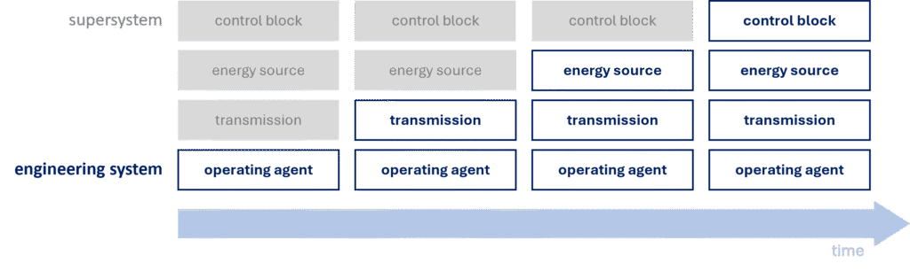

Quá trình tích hợp không nhất thiết là chuỗi bốn bước đơn giản. Việc tích hợp từng khối có thể diễn ra qua nhiều bước nhỏ. Ví dụ hệ không có ngay động cơ hoàn chỉnh – trước đó có thể chỉ là lò xo hoặc dây cung tích năng. Khối điều khiển của hệ sưởi có thể phát triển dần thông qua thermostat, hẹn giờ, v.v.

### Xu hướng gia tăng khả năng điều khiển

# Xu hướng gia tăng khả năng điều khiển

***Xu hướng gia tăng khả năng điều khiển**: khi hệ thống kỹ thuật tiến hóa, nó phát triển thêm nhiều cách thức điều khiển.*

## Tổng quan

Cùng với xu hướng phát triển không đồng đều của các thành phần, xu hướng gia tăng khả năng điều khiển là cơ chế của xu hướng gia tăng mức độ phối hợp.

“Điều khiển” ở đây là các hành động nhằm điều chỉnh giá trị tham số của hệ để phù hợp với những biến thiên của siêu hệ và môi trường xung quanh.

## Cơ chế của xu hướng gia tăng khả năng điều khiển

Xu hướng gia tăng động hóa là xu hướng con của xu hướng này. Ngoài ra, bản thân xu hướng còn có hai cơ chế riêng, cho rằng khi hệ tiến hóa:

1. mức độ điều khiển bên trong hệ tăng lên, và
2. số trạng thái có thể điều khiển tăng lên.

### Mức độ điều khiển bên trong hệ tăng lên

Theo cơ chế này, hệ phát triển theo lộ trình:

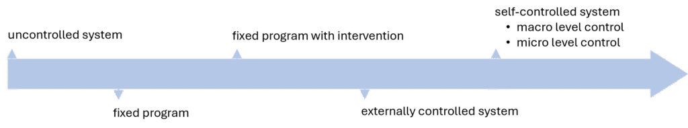

Ban đầu hệ **không được điều khiển**, không có khối điều khiển riêng (ví dụ hệ chiếu sáng văn phòng bật/tắt thủ công). Khi có khối điều khiển, hệ bắt đầu tự điều khiển – trước hết theo **chương trình cố định** (ví dụ bật/tắt theo bộ hẹn giờ). Giai đoạn tiếp theo cho phép **can thiệp vào chương trình cố định** (chuyển chế độ cuối tuần, điều chỉnh thời gian bật/tắt theo độ dài ngày). Sau đó là hệ **được điều khiển từ bên ngoài** (ví dụ quản lý tòa nhà theo dõi phòng sử dụng và bật/tắt đèn thủ công).

Cuối cùng hệ đạt mức **tự điều khiển hoàn toàn** – ví dụ cảm biến hiện diện phát hiện người trong phòng và tự điều chỉnh đèn. Có thể phân biệt **điều khiển vĩ mô** và **vi mô**.

Ví dụ điều khiển vĩ mô: hệ có cảm biến phát hiện điều kiện môi trường và điều chỉnh ánh sáng (bật/tắt theo hiện diện, ánh sáng tự nhiên...).

Trong điều khiển vi mô, không có thành phần cảm biến riêng biệt; hệ sử dụng vật liệu hoặc hiện tượng vật lý đặc thù để phản ứng trực tiếp với biến đổi mà không cần phát hiện trước. Ví dụ điển hình là van một chiều hoạt động nhờ lực của chất lỏng chảy qua; van tự mở/đóng mà không cần cảm biến hay tín hiệu bên ngoài.

### Số trạng thái có thể điều khiển tăng lên

Xu hướng con này cho rằng khi hệ tiến hóa, số trạng thái có thể điều khiển tăng dần theo trình tự:

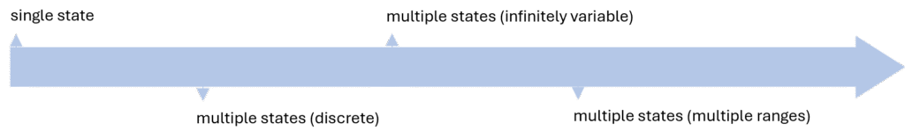

Ví dụ: điều chỉnh thông số âm thanh trong các hệ phát nhạc. Máy hát đĩa đời đầu chỉ có một mức âm lượng cố định (**một trạng thái**) vì không thể chỉnh trong khi phát. Sau đó xuất hiện các công tắc bậc, cho phép chọn **vài mức rời rạc**. Tiếp theo là núm vặn liên tục, cung cấp dải **vô số trạng thái liên tục**. Thiết bị hiện đại sử dụng chiết áp số (digital potentiometer) điều khiển chính xác không chỉ âm lượng mà còn âm sắc, cân bằng kênh, equalizer… – tức có **nhiều dải điều khiển** khác nhau.

#### Phối hợp hình dạng

Phối hợp hình dạng có thể xuất hiện theo bốn cách:

**ĐỒNG NHẤT** – các phần tử khớp với nhau hoàn hảo, ví dụ:

- bu-lông và đai ốc, nơi bước ren phải trùng khớp mới vặn được,
- đầu tua-vít và rãnh vít,
- quả trứng và khay đựng trứng,
- chìa khóa và ổ khóa.

**TỰ TƯƠNG THÍCH** – hình dạng cho phép xếp chồng hoặc lồng ghép gọn gàng, ví dụ:

- dao nĩa dùng một lần,
- container vận tải,
- ghế xếp sân vườn.

**TƯƠNG THÍCH** – hình dạng được tối ưu hóa theo một tham số của siêu hệ, ví dụ:

- tay nắm cửa, nội thất hoặc chuột máy tính được thiết kế công thái học để vừa vặn bàn tay người,
- rây bột có hình dạng phù hợp để làm việc hiệu quả với nguyên liệu dạng bột.

**ĐẶC BIỆT** – các hình dạng không thuộc ba nhóm trên nhưng được tạo ra để thực hiện mục đích đặc thù, ví dụ:

- mũi tàu phá băng có hình dạng đặc biệt để phá vỡ lớp băng,
- lưỡi xẻng được thiết kế giúp hót và di chuyển cát/dất dễ dàng hơn.

#### Phối hợp nhịp điệu

Sự phối hợp nhịp điệu có thể diễn ra theo ba cách:

**ĐỒNG NHẤT**, ví dụ:

- chuyển động van trong động cơ đốt trong được đồng bộ hoàn hảo với hành trình piston để nạp/nén – xả đúng thời điểm,
- âm thanh và hình ảnh trong hệ AV phát đồng bộ để tránh “lệch tiếng” (lip sync),
- kính 3D đồng bộ hình ảnh cung cấp cho mắt trái/phải.

**BỔ TRỢ** – các thành phần không hoạt động đồng thời mà lần lượt thay phiên, tận dụng thời gian rỗi của nhau, ví dụ:

- chương trình SETI@home chỉ chạy khi máy tính nhàn rỗi (chế độ screensaver),
- robot cộng tác (cobot) trên dây chuyền: robot bắt vít khi công nhân tạm dừng, rồi dừng lại để công nhân đặt chi tiết tiếp theo.

**ĐẶC BIỆT** – các dạng phối hợp khác, ví dụ:

- máy mát xa trị liệu siêu âm điều chỉnh tần số rung khớp với cộng hưởng của cơ và mô dưới da,
- hệ tưới tiêu nông nghiệp chính xác, điều chỉnh nhịp tưới theo pha sinh trưởng và nhịp sinh học của cây (chu kỳ thoát hơi nước).

#### Phối hợp vật liệu

Danh mục gợi ý khi tìm vật liệu phù hợp cho phối hợp gồm:

**VẬT LIỆU ĐỒNG NHẤT**, ví dụ:

- cấy ghép nội tạng đã nhân bản,
- sửa mặt đường bằng hỗn hợp vật liệu giống hệt ban đầu.

**VẬT LIỆU TƯƠNG ĐỒNG**, ví dụ:

- cấy ghép nội tạng từ người hiến,
- chèn miếng gỗ cùng loại vào đồ gỗ.

**VẬT LIỆU TRƠ**, ví dụ:

- cấy ghép nội tạng nhân tạo,
- trám bề mặt gỗ bằng bột trét.

**VẬT LIỆU CÓ THAM SỐ LỆCH**, tức phối hợp tạo hiệu ứng dựa trên chênh lệch đặc tính, ví dụ:

- cặp nhiệt điện (thermocouple) gồm hai kim loại khác nhau; chênh lệch nhiệt độ tại mối ghép sinh ra điện áp (hiệu ứng nhiệt điện).

**VẬT LIỆU CÓ THAM SỐ ĐỐI NGHỊCH**, ví dụ:

- dây cáp gồm lõi dẫn điện và lớp cách điện.

#### Phối hợp hành động

Sự tương tác giữa công cụ và sản phẩm có thể diễn ra tại điểm (0D), dọc theo đường (1D), trên bề mặt (2D) hoặc trong thể tích (3D). Phối hợp hành động liên quan tới việc chuyển đổi giữa các dạng tiếp xúc này, theo hai hướng:

- tiến dọc chuỗi: 0D → 1D → 2D → 3D, hoặc
- lùi dọc chuỗi: 3D → 2D → 1D → 0D.

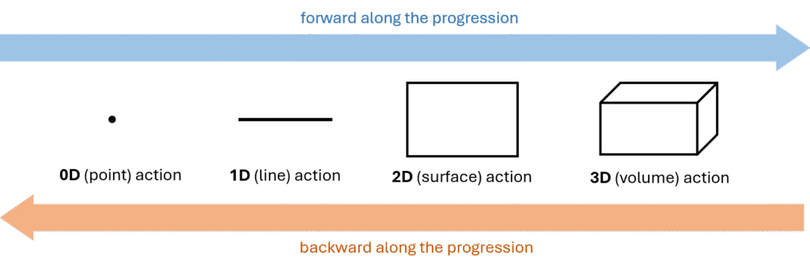

Ví dụ tiến dọc chuỗi: chiếc “máy giặt” nguyên thủy chỉ là hòn đá đập quần áo – tiếp xúc điểm (**0D**). Sau đó dùng gậy (**1D**), tiếp nữa là bàn giặt gợn sóng (**2D**) và cuối cùng là máy giặt hiện đại (**3D**).

Ví dụ lùi dọc chuỗi: đáy hộp pizza phẳng (**2D**) khiến hơi ẩm tích tụ làm mềm vỏ. Thiết kế đáy gân (**1D**) cải thiện thông khí; thêm các điểm đỡ (**0D**) giúp vỏ giòn hơn.

Hướng chuyển đổi phụ thuộc vào:

1. chức năng là hữu ích hay có hại, và
2. nguồn lực sẵn có.

Bảng sau minh họa cách lựa chọn hướng chuyển đổi:

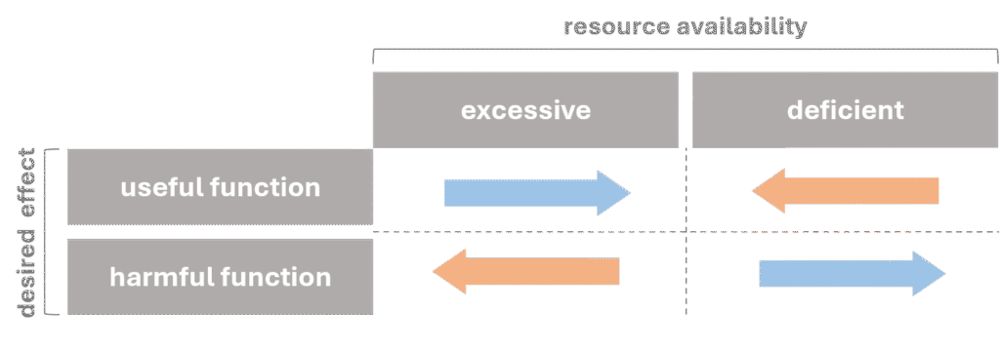

### Xu hướng gia tăng mức độ cắt gọn

# Xu hướng gia tăng mức độ cắt gọn

***Xu hướng gia tăng mức độ cắt gọn**: khi hệ thống kỹ thuật tiến hóa, các phần tử (thành phần hoặc thao tác) được loại bỏ mà không làm suy giảm – thậm chí cải thiện – chức năng của hệ.*

## Tổng quan

Xu hướng này là một trong bốn cơ chế trực tiếp hỗ trợ xu hướng gia tăng giá trị (cùng với xu hướng chuyển sang siêu hệ, xu hướng gia tăng mức độ đầy đủ của các khối chức năng và xu hướng tăng cường dòng chảy).

Theo xu hướng, càng về sau hệ càng cắt gọn nhiều thành phần – cả trong thiết bị lẫn quy trình (thao tác).

Xu hướng này khá phổ quát, có thể áp dụng ở bất kỳ giai đoạn nào. Tuy nhiên trong thực tế, hệ thường phình to ở giai đoạn đầu đường cong chữ S; việc cắt gọn trở nên quan trọng hơn ở giai đoạn 3 và 4.

Các quy tắc cắt gọn giải thích ***cách*** thực hiện cắt gọn, trong khi xu hướng cho biết ***nên cắt gì*** và ***theo thứ tự nào***. Xu hướng gồm ba cơ chế:

1. cắt gọn các khối chức năng,
2. cắt gọn các thao tác, và
3. [cắt gọn các thành phần có giá trị thấp nhất](http://Trimming components with the lowest value).

## Cắt gọn các khối chức năng

Cơ chế này tập trung vào các khối chức năng của hệ.

Xu hướng gia tăng mức độ đầy đủ cho thấy hệ lần lượt sở hữu: tác nhân vận hành, truyền dẫn, nguồn năng lượng, điều khiển. Giờ đây – để tiếp tục tăng giá trị – hệ loại bỏ các khối này theo thứ tự ngược lại:

1. truyền dẫn,
2. nguồn năng lượng,
3. hệ điều khiển,
4. tác nhân vận hành.

Về lâu dài, hệ tiến hóa thành tác nhân vận hành tự điều khiển (thông minh) tự tạo năng lượng.

## Cắt gọn thao tác

Xu hướng con này áp dụng cho quy trình.

Theo đó, thao tác nên được cắt theo thứ tự: 1) thao tác có chức năng hiệu chỉnh, 2) thao tác có chức năng cung cấp...
### Xu hướng gia tăng động hóa

# Xu hướng gia tăng động hóa

***Xu hướng gia tăng động hóa**: khi hệ thống kỹ thuật tiến hóa, bản thân hệ và các thành phần trở nên “động” hơn.*

## Tổng quan

Xu hướng gia tăng động hóa là xu hướng con của xu hướng gia tăng khả năng điều khiển. Nó gồm ba xu hướng con chính:

1. động hóa thiết kế (bao gồm tuyến động hóa chất và tuyến động hóa trường),
2. động hóa thành phần, và
3. động hóa chức năng.

## Động hóa thiết kế

Xu hướng con này còn được gọi là **động hóa thành phần**. Một thành phần của hệ kỹ thuật có thể là chất, trường hoặc kết hợp cả hai, vì vậy có hai tuyến phát triển riêng biệt.

### Tuyến động hóa chất

Hệ phát triển từ cấu trúc cứng nhắc sang cấu trúc linh hoạt:

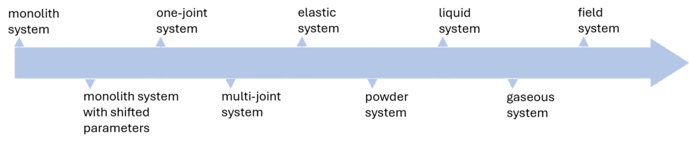

Một hệ mới thường khởi đầu như một **khối nguyên** nên được xem là điểm xuất phát. Đây là cấu trúc đơn giản nhất nhưng cũng kém thích nghi nhất – các thuộc tính không thể thay đổi trong quá trình vận hành. Khi hệ tiến hóa, mức độ động hóa tăng dần: khối nguyên được chia thành các vùng không gian có **thuộc tính khác nhau**. Tiếp theo, hệ trở thành **hệ một khớp**, rồi **hệ đa khớp**, trong đó mỗi khớp tượng trưng cho một bậc tự do. Cuối cùng, số khớp tăng đến mức toàn bộ hệ (hoặc từng phần) trở nên **mềm dẻo hoặc đàn hồi**. Sau đó hệ có thể tiếp tục phát triển thành dạng **bột**, **lỏng** và cuối cùng là **khí**. Bước tiến cuối cùng là **hệ dựa trên trường**, vốn dễ điều khiển và thích ứng hơn vật chất, khiến hệ trở nên năng động hơn nữa.

### Tuyến động hóa trường

Hệ tiến từ trường hằng sang trường phức tạp:

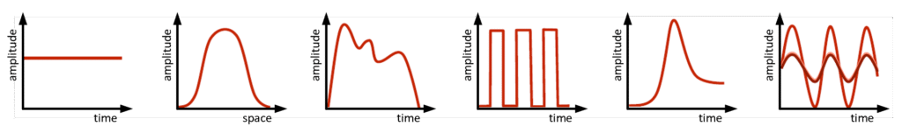

Hệ mới ra đời thường sử dụng **trường hằng**. Bước tiếp theo là chuyển sang **trường gradient**, rồi **trường biến thiên** (tham số thay đổi theo thời gian). Tiếp đến là trường **xung** và **cộng hưởng**. Giai đoạn cuối dùng các **trường phức tạp**, khai thác giao thoa sóng đứng và sóng chạy.

## Động hóa thành phần

Còn gọi là **phân đoạn thành phần**. Hệ phát triển theo chuỗi:

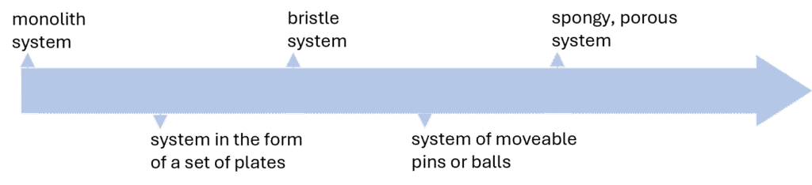

Trong tài liệu lịch sử, Altshuller đề cập thêm xu hướng tăng độ rỗng (từ khối đặc → một lỗ → nhiều lỗ → vi lỗ), nhưng xu hướng này chưa được nghiên cứu đầy đủ nên chưa nằm trong hệ thống TESE chính thức.

## Động hóa chức năng

Xu hướng con này cho rằng hệ tiến hóa từ đơn chức năng sang đa chức năng, không có trạng thái trung gian.

### Xu hướng gia tăng giá trị

# Xu hướng gia tăng giá trị

***Xu hướng gia tăng giá trị**: khi hệ thống kỹ thuật tiến hóa, giá trị của nó luôn tăng.*

## Tổng quan

Xu hướng gia tăng giá trị, còn gọi là **xu hướng tăng tính lý tưởng**, là cơ chế chính của xu hướng tiến hóa đường cong chữ S. Mọi xu hướng khác đều đóng vai trò hỗ trợ.

Theo xu hướng, để hệ duy trì tính cạnh tranh và hấp dẫn thị trường, giá trị của nó phải liên tục tăng. Có hai cách đạt được điều này:

- áp dụng các xu hướng nằm phía dưới trong hệ phân cấp, hoặc
- sử dụng các cơ chế nội tại của xu hướng – mô hình hóa giá trị như tỷ số giữa tổng chức năng và tổng chi phí của hệ.

## Cơ chế nội tại của xu hướng gia tăng giá trị

Việc tăng giá trị luôn được xét trong **bối cảnh một MPV cụ thể**.

Theo định nghĩa, giá trị tỉ lệ thuận với tổng chức năng và tỉ lệ nghịch với tổng chi phí. Dù ở giai đoạn nào của đường cong chữ S, chức năng phải trội hơn chi phí để hệ tồn tại.

Lợi thế này có thể duy trì bằng nhiều chiến lược. Việc xác định hệ đang ở giai đoạn nào của đường cong chữ S (theo MPV đang xét) giúp lựa chọn chiến lược phù hợp. Biểu đồ dưới gợi ý chiến lược cho từng giai đoạn:

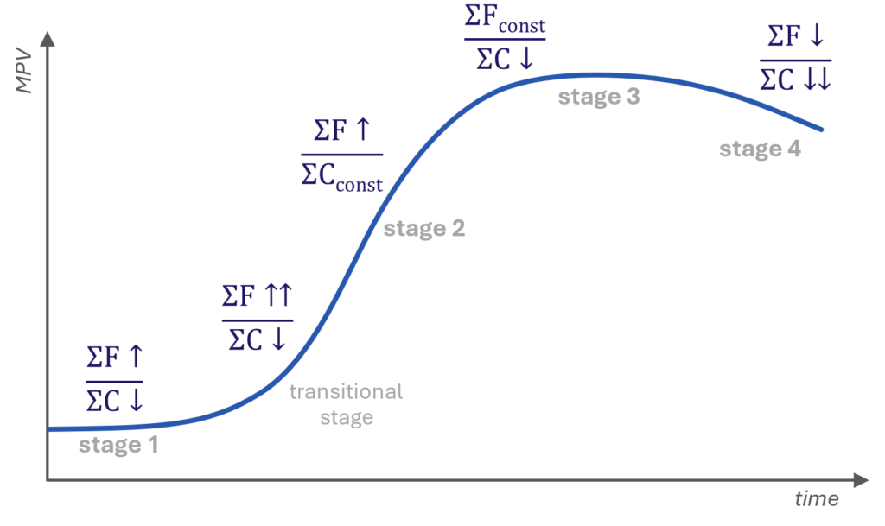

|  | **Chiến lược** | **Giải thích** |
| --- | --- | --- |
| **Giai đoạn 1** | **ΣF↑ / ΣC↓**  tập trung cải thiện chức năng đồng thời giảm chi phí | Giai đoạn đầu cho phép thực hiện thay đổi lớn vì hệ còn linh hoạt. |
| **Giai đoạn 2** | **ΣF↑↑ / ΣC↑** hoặc **ΣF↑ / ΣCconst**  đảm bảo chức năng tăng nhanh hơn chi phí | Khi MPV tăng nhanh, chi phí thường tăng theo; chức năng phải tăng nhanh hơn. Nếu chức năng tăng chậm, chi phí phải giữ ổn định. |
| **Giai đoạn 3** | **ΣFconst / ΣC↓**  ưu tiên giảm chi phí | Giai đoạn chín muồi khó cải thiện chức năng, nên tập trung tối ưu hóa, cắt giảm chi phí. |
| **Giai đoạn 4** | **ΣF↓ / ΣC↓↓**  chủ động giảm chức năng để giảm mạnh chi phí | Hệ tiến gần giai đoạn suy thoái. Giảm chức năng có chủ đích (ví dụ sản phẩm dùng một lần) giúp giảm chi phí và tăng sức hấp dẫn. |

### Xu hướng tiến hóa đường cong chữ S

# Xu hướng tiến hóa đường cong chữ S

***Xu hướng tiến hóa đường cong chữ S**: xu hướng đứng đầu hệ phân cấp TESE. Theo đó, khi hệ thống kỹ thuật tiến hóa, diễn biến của từng tham số giá trị chính (MPV) theo thời gian tạo thành đường cong chữ S.*

## Tổng quan

Với mỗi MPV, hệ kỹ thuật phát triển theo đường cong chữ S, đi qua các giai đoạn:

|  |  |
| --- | --- |
| **Giai đoạn 1:** | hệ “sơ sinh” chưa vào thị trường, có thể mới chỉ là ý tưởng, phác thảo, nguyên mẫu. |
| **Giai đoạn 2:** | giai đoạn tăng trưởng mạnh – hệ được sản xuất đại trà. |
| **Giai đoạn 3:** | hệ chín muồi, vẫn sản xuất hàng loạt nhưng chạm các giới hạn phát triển. |
| **Giai đoạn 4:** | hệ mất tính thực dụng hoặc chỉ tồn tại trong các lĩnh vực đặc thù/siêu hệ – giai đoạn suy thoái. |

Nếu vượt qua giai đoạn 1, hệ đi vào giai đoạn chuyển tiếp – phần cuối giai đoạn 1 theo TRIZ – khi hệ rời phòng thí nghiệm để bước vào thị trường. Đây là thời điểm rủi ro cao nhất vì hệ phải cạnh tranh với cả hệ mới và hệ trưởng thành.

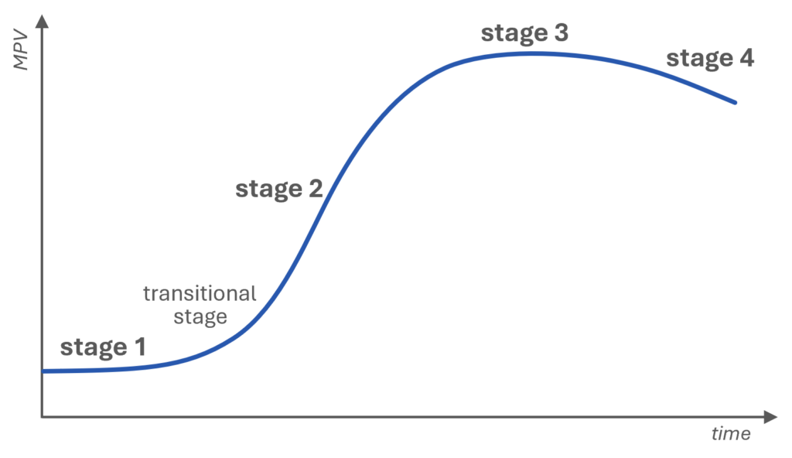

Xu hướng đường cong chữ S được coi là luật tổng quát, đứng đầu hệ phân cấp. Để hệ tiến dọc đường cong chữ S, giá trị của nó (trong bối cảnh MPV đang xét) phải liên tục tăng. Do đó xu hướng gia tăng giá trị là động lực trực tiếp; các xu hướng khác đều là xu hướng con. Khi hệ tiến hóa theo bất kỳ xu hướng nào, điều đó trực tiếp làm tăng giá trị và đẩy hệ tiến lên trên đường cong chữ S.

#### Bài viết

- Tham số giá trị chính
- Đường cong chữ S

### Tham số giá trị chính

# Tham số giá trị chính

***Tham số giá trị chính** (Main Parameter of Value – MPV) là thuộc tính, tham số hoặc đặc tính quan trọng quyết định lựa chọn mua hàng của khách hàng.*

## Tổng quan

MPV là thuộc tính có ảnh hưởng lớn tới quyết định của khách hàng, qua đó quyết định sự thành công của hệ thống kỹ thuật trên thị trường. Nói cách khác, MPV chính là yếu tố then chốt mà khách hàng cân nhắc khi đánh giá mức độ hấp dẫn của sản phẩm.

Ví dụ với robot nhà bếp, các MPV có thể bao gồm:

- công suất động cơ – quyết định khả năng xử lý và hiệu suất,
- số lượng phụ kiện – mở rộng phạm vi chức năng,
- vật liệu cấu thành – ảnh hưởng tới độ bền và tuổi thọ,
- hình dáng thân máy – quyết định tính công thái học khi sử dụng.

Mỗi tham số định hướng cho lộ trình phát triển. Khi phân tích MPV, nhà sản xuất có thể chọn đúng trọng tâm đổi mới và ưu tiên cải thiện tham số nào.

#### Đường cong chữ S

# Đường cong chữ S

***Đường cong chữ S** là đường cong hình chữ S thể hiện sự phụ thuộc điển hình của tham số giá trị chính (MPV) theo thời gian trong quá trình tiến hóa của hệ thống kỹ thuật.*

## Tổng quan

Đường cong chữ S mô tả vòng đời của một MPV theo thời gian: khởi đầu, tăng trưởng, chín muồi và suy thoái. Trục hoành biểu thị thời gian, trục tung biểu thị giá trị hoặc hiệu năng của MPV được xét.

Khái niệm đường cong chữ S vốn xuất xứ từ sinh học. Đầu thế kỷ XX, các nhà khoa học nhận thấy sự tăng trưởng của quần thể vi khuẩn gồm bốn pha: khởi phát chậm, bùng nổ, ổn định và suy giảm do cạn kiệt tài nguyên – đồ thị giống chữ S.

Qua nghiên cứu, Altshuller nhận ra các MPV trong hệ kỹ thuật cũng tiến hóa theo những đường cong chữ S riêng biệt.

Để xác định hệ đang ở giai đoạn nào, Altshuller đề xuất một số chỉ báo. Đây là phần quan trọng của TRIZ cổ điển, tuy nhiên việc áp dụng thực tiễn đôi khi gặp hạn chế và kết quả không phải lúc nào cũng tin cậy. Tiếp nối nền tảng đó, phân tích đường cong chữ S thực dụng đã được phát triển.

## Các giai đoạn của đường cong chữ S

Mỗi hệ đi qua bốn giai đoạn chính:

|  |  |
| --- | --- |
| **GIAI ĐOẠN 1:** | Hệ "sơ sinh" **chưa vào thị trường**; có thể chỉ tồn tại dưới dạng ý tưởng, phác thảo hoặc nguyên mẫu. **MPV gần như phẳng**. |
|  | Nếu vượt qua giai đoạn này, hệ bước vào **GIAI ĐOẠN CHUYỂN TIẾP** – phần cuối của giai đoạn 1 theo TRIZ. Hệ còn non trẻ, nhạy cảm với tác động bên ngoài nhưng đã **gần sẵn sàng thương mại hóa** hoặc đang phục vụ một **phân khúc rất hẹp**. **MPV bắt đầu tăng** rõ rệt. |
| **GIAI ĐOẠN 2:** | Giai đoạn tăng trưởng và mở rộng mạnh – hệ được **sản xuất hàng loạt**, thích nghi với nhiều ứng dụng, các biến thể phát triển đa dạng, siêu hệ bắt đầu thích ứng. **MPV tăng nhanh**. |
| **GIAI ĐOẠN 3:** | Hệ trưởng thành **chạm các giới hạn phát triển**. Vẫn được **sản xuất hàng loạt**, mở rộng sang ứng dụng mới, đòi hỏi nguồn lực chuyên biệt; cải tiến đòi hỏi chi phí cao. Siêu hệ thích nghi mạnh mẽ. **MPV ổn định và tăng chậm**. |
| **GIAI ĐOẠN 4:** | Giai đoạn **suy thoái**. Hệ mất chức năng thực dụng, chuyển thành đồ giải trí, trang trí, thể thao… hoặc chỉ tồn tại trong **lĩnh vực chuyên biệt/siêu hệ**. **MPV giảm**. |

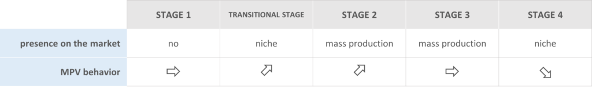

## Các chỉ báo theo Altshuller

Altshuller đề xuất bốn chỉ báo giúp xác định giai đoạn vận hành của hệ:

1. **Diễn biến của MPV** – thường dễ đo nhất.
2. **Số lượng sáng chế** – thường biểu diễn bằng số bằng sáng chế; dữ liệu dễ thu thập từ các cơ sở dữ liệu trực tuyến.
3. **Mức độ sáng chế** – chỉ báo có tính chủ quan vì phụ thuộc đánh giá của chuyên gia.
4. **Lợi nhuận** – chỉ báo khó thu thập nhất; với các hệ là phân hệ của hệ lớn hơn, đôi khi gần như không thể tách riêng.

Biểu đồ sau cho thấy cách các chỉ báo biến đổi khi hệ tiến hóa:

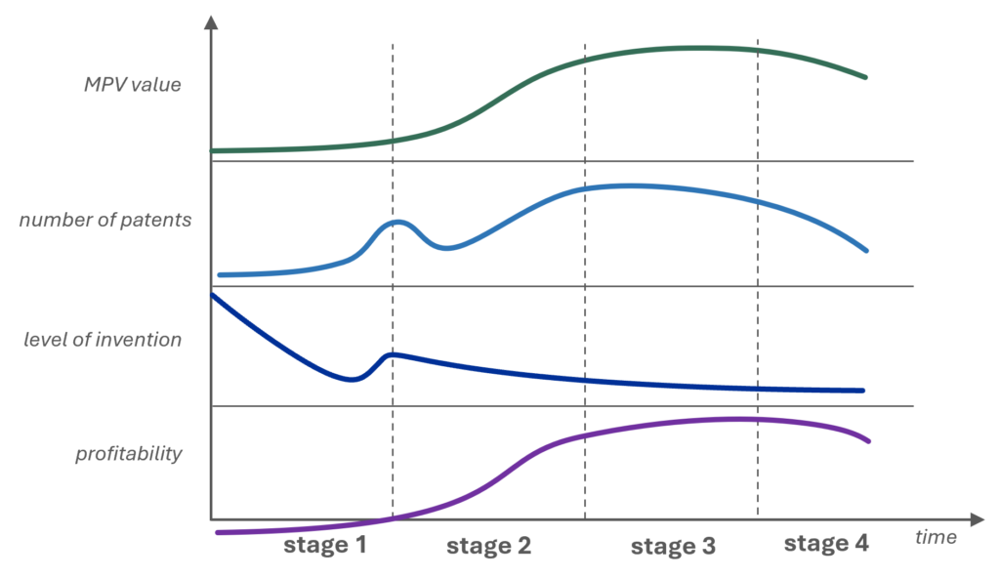

### Giá trị MPV

Ở giai đoạn đầu, MPV thường thấp do hệ còn đang hoàn thiện. Trong giai đoạn tăng trưởng mạnh, MPV tăng nhanh vì hệ được tối ưu cho sản xuất hàng loạt và nhu cầu thị trường. Khi bước sang giai đoạn chín muồi, MPV có thể đạt đỉnh hoặc tăng chậm lại; đến giai đoạn suy thoái, MPV giảm khi hệ lỗi thời hoặc kém cạnh tranh.

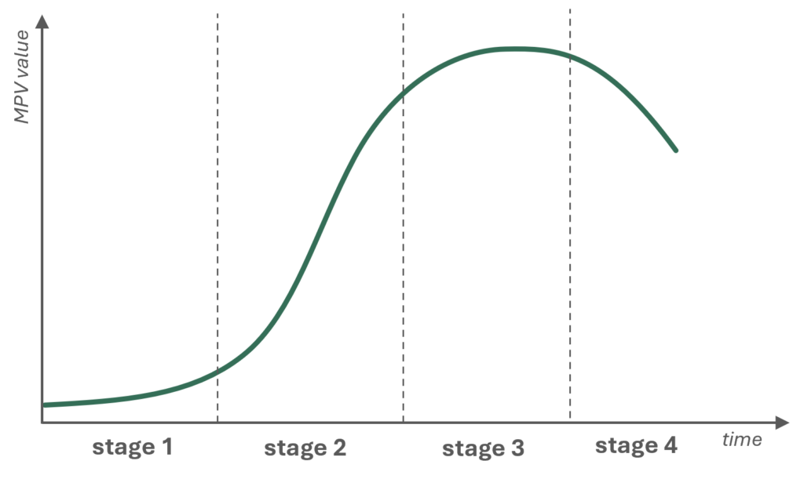

### Số lượng bằng sáng chế

Số lượng bằng sáng chế là chỉ báo dễ thu thập từ cơ sở dữ liệu công khai. Thông thường, đường cong có hai đỉnh rõ rệt:

1. khi hệ được đưa vào sản xuất hàng loạt, và
2. khi nỗ lực kéo dài vòng đời hệ.

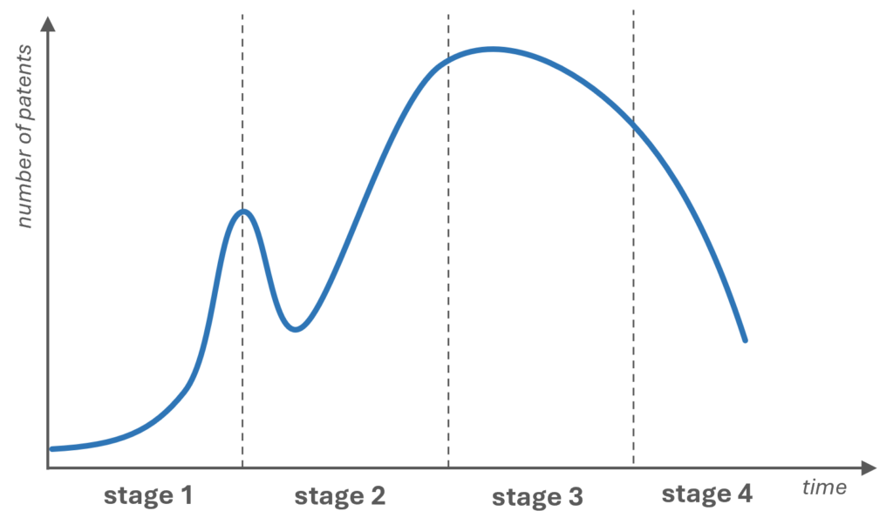

Ở giai đoạn đầu, số bằng sáng chế thấp do chưa có ứng dụng thực tế. Sang giai đoạn 2, nhu cầu công nghệ phục vụ sản xuất và phổ cập tăng, doanh nghiệp và nhà sáng chế chạy đua đăng ký bảo hộ nên số bằng sáng chế tăng vọt.

Ở giai đoạn 3, số bằng sáng chế tiếp tục tăng nhưng vì lý do khác: hệ đã chín muồi, các kỹ sư tập trung tối ưu hóa, kéo dài tuổi thọ và tìm ứng dụng mới để duy trì lợi nhuận.

Đến giai đoạn 4, số bằng sáng chế giảm hẳn. Công nghệ đạt đỉnh, cơ hội đổi mới hạn chế; xu hướng giảm phản ánh việc hệ bị thay thế hoặc loại bỏ nên động lực đăng ký sáng chế suy yếu.

### Mức độ sáng chế

Mức độ sáng chế là chỉ báo khó đo hơn vì phụ thuộc đánh giá chủ quan. Việc phân tích lịch sử của một hệ theo chỉ báo này thường rất tốn thời gian. Hệ trẻ có mức độ sáng chế cao nhưng giảm dần theo thời gian; trong giai đoạn ứng dụng đại trà có thể xuất hiện một đợt tăng tạm thời rồi lại giảm.

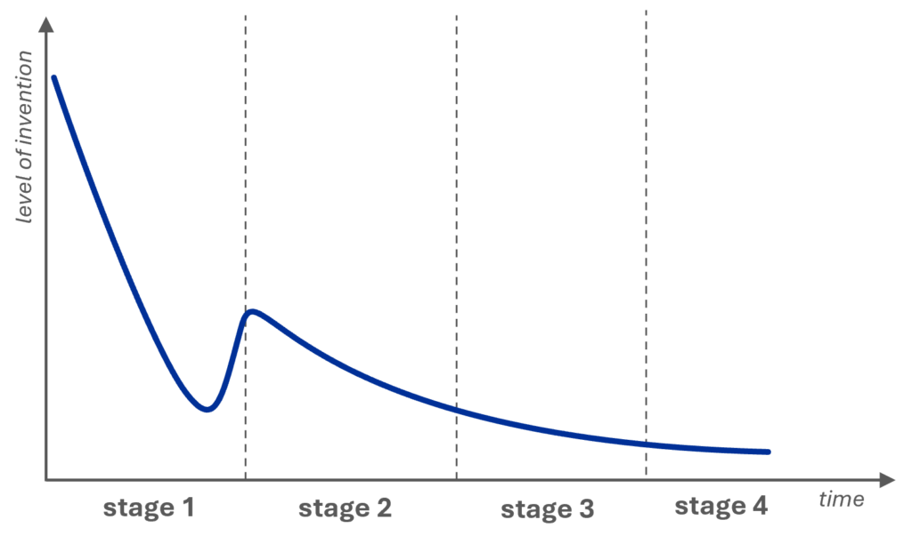

Altshuller chia sáng chế thành năm mức dựa trên cách giải mâu thuẫn và phạm vi đổi mới:

- **Mức 1**: cải tiến nhỏ, không giải mâu thuẫn; chủ yếu tinh chỉnh cấu trúc dựa trên thử nghiệm, dùng tri thức sẵn có của hệ.
- **Mức 2**: giải được mâu thuẫn đơn giản; thay đổi lớn hơn mức 1 nhưng vẫn trong cùng lĩnh vực kỹ thuật, đôi khi cần kiến thức phụ trợ.
- **Mức 3**: giải pháp tiên tiến, bất ngờ nhưng vẫn trong cùng lĩnh vực; đòi hỏi kiến thức từ các ngành liên quan.
- **Mức 4**: giải pháp đột phá bằng cách ứng dụng tri thức của lĩnh vực này vào vấn đề của lĩnh vực khác (ví dụ dùng nguyên lý sinh học xử lý bài toán cơ học).
- **Mức 5**: bước ngoặt dựa trên nghiên cứu khoa học nền tảng, tạo nguyên lý mới có thể thay đổi cả ngành – như laser hoặc radio – vượt ra ngoài phạm vi các phương pháp giải quyết vấn đề truyền thống, kể cả TRIZ.

### Lợi nhuận

Lợi nhuận thường khó thu thập nhất; với phân hệ trong hệ lớn, việc tách riêng gần như bất khả. Hệ trẻ dù có mức độ sáng chế cao nhưng chưa tạo doanh thu – thường chỉ tồn tại trên giấy hoặc vài nguyên mẫu, còn nhiều nhược điểm. Lợi nhuận xuất hiện khi hệ bước vào giai đoạn ứng dụng đại trà, lúc những cải tiến dù nhỏ cũng đem lại giá trị đáng kể.

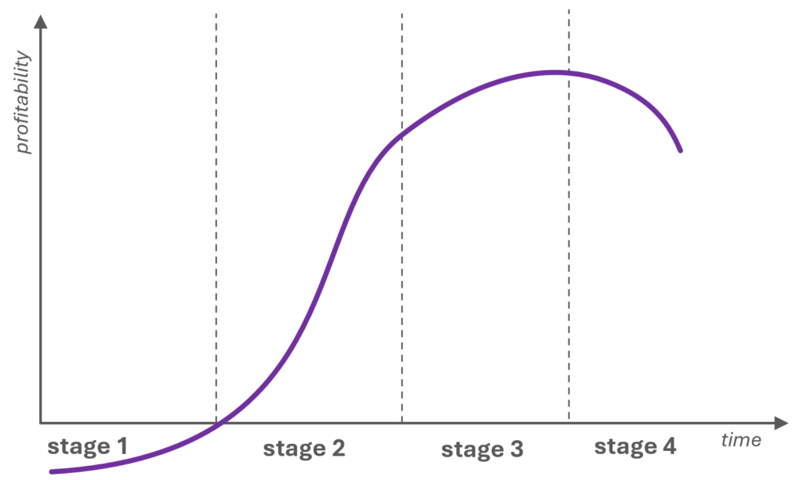

### Xu hướng chuyển sang siêu hệ

# Xu hướng chuyển sang siêu hệ

***Xu hướng chuyển sang siêu hệ** cho rằng khi hệ thống kỹ thuật tiến hóa, nó sẽ được tích hợp với các thành phần của siêu hệ.*

## Tổng quan

Hiểu một cách đơn giản, chuyển sang siêu hệ chính là lai ghép hệ với các thành phần của siêu hệ. Việc tích hợp vừa mang lại thêm nguồn lực để cải thiện chức năng, vừa mở ra cơ hội cắt bỏ các thành phần trở nên dư thừa sau khi hợp nhất, từ đó giảm chi phí.

## Các cơ chế của xu hướng

Xu hướng này được nghiên cứu rất sâu và bao gồm bốn cơ chế giúp xác định cần kết hợp những hệ nào, mức độ tích hợp, số hệ tham gia…:

1. **Tham số** của các hệ cùng thực hiện một chức năng chính ngày càng khác biệt.
2. **Chức năng chính** của các hệ được tích hợp ngày càng khác nhau.
3. **Mức độ tích hợp** ngày càng sâu.
4. **Số lượng hệ** được tích hợp ngày càng tăng.

### Gia tăng khác biệt về tham số

Cơ chế này mô tả cách hợp nhất các hệ cùng chức năng chính. Chuỗi tiến hóa gồm:

- các hệ **đồng nhất** (tham số giống nhau),
- các hệ **khác nhau ở ít nhất một tham số**, rồi
- các **hệ cạnh tranh** – khác nhau nhưng cùng thực hiện chức năng chính tương tự.

Thuật toán chi tiết để lai ghép các hệ cạnh tranh chính là công cụ chuyển giao đặc tính.

### Gia tăng khác biệt về chức năng chính

Cơ chế này giải thích cách hợp nhất các hệ có chức năng chính khác nhau – có thể xem là bước tiếp theo của cơ chế trên. Các mức độ gồm:

- **hệ đồng minh**: chức năng khác nhau nhưng có điểm chung (ví dụ cùng đối tượng chức năng, cùng quy trình, cùng bối cảnh sử dụng),
- **hệ dị loại**: chức năng khác nhau và không có điểm chung,
- **hệ nghịch đảo**: thực hiện các chức năng chính đối lập.

### Tăng độ sâu tích hợp

Cơ chế này cho biết mức tích hợp nên đạt tới đâu:

- **hệ không liên kết**: đặt cạnh nhau mà không có liên kết liên tục,
- **hệ cắt gọn một phần**: một số thành phần trở nên dư thừa và bị cắt bỏ,
- **hệ cắt gọn hoàn toàn**: tích hợp sâu đến mức khó nhận ra hệ ban đầu; thường một hệ bị cắt gọn toàn bộ.

### Tăng số lượng hệ được tích hợp

Cơ chế cuối cùng mô tả số hệ tham gia:

- **mono-system**: một hệ đơn lẻ – điểm khởi đầu,
- **bi-system**: kết hợp hai hệ,
- **poly-system**: kết hợp nhiều hệ.

Khi hệ phát triển, số hệ được tích hợp có xu hướng tăng dần.

### Xu hướng phát triển không đồng đều của các thành phần

# Xu hướng phát triển không đồng đều của các thành phần

***Xu hướng phát triển không đồng đều của các thành phần** cho rằng khi hệ thống kỹ thuật tiến hóa, tác nhân vận hành phát triển trước, các phần còn lại phát triển sau.*

## Tổng quan

Cùng với xu hướng gia tăng khả năng điều khiển, xu hướng này là cơ chế của xu hướng gia tăng mức độ phối hợp.

Xu hướng tạo cầu nối giữa kỹ thuật và triết học: hệ tiến hóa nhờ giải mâu thuẫn, còn mâu thuẫn xuất hiện do các thành phần phát triển không đồng đều. Khi một phần phát triển nhanh hơn phần khác, sự lệch pha xuất hiện và kích hoạt chuỗi cải tiến tiếp theo.

Xu hướng này gắn trực tiếp với đường cong chữ S:

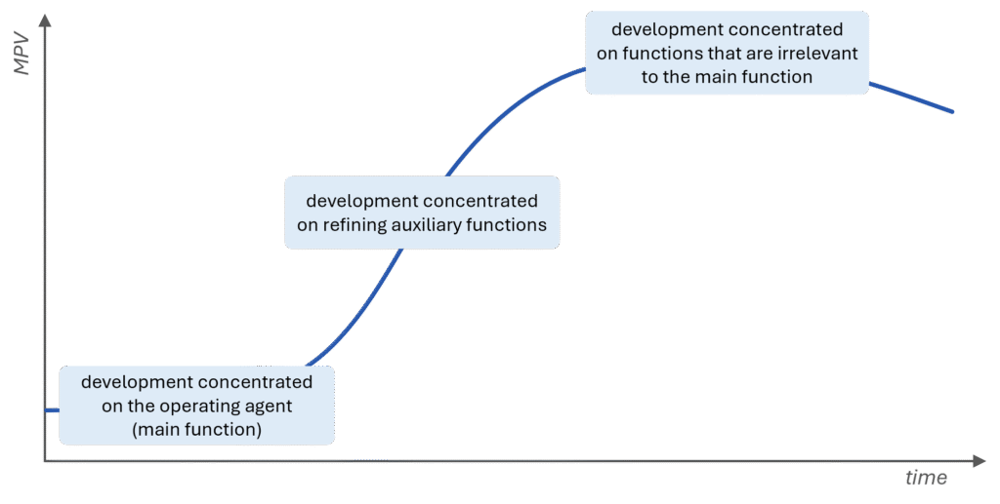

Ví dụ điển hình là sự phát triển của ô tô. Trong những chiếc xe đầu tiên, động cơ là thành phần tiên tiến nhất. Dần dần, khoảng cách giữa động cơ và các hệ phụ khác xuất hiện, kéo theo sự phát triển của hệ truyền động, hộp số, khung vỏ, điều hòa… – tất cả nhằm san bằng tốc độ phát triển giữa các thành phần.

